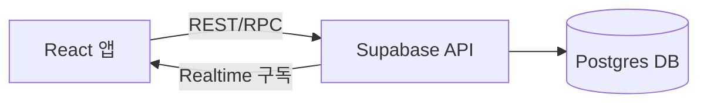
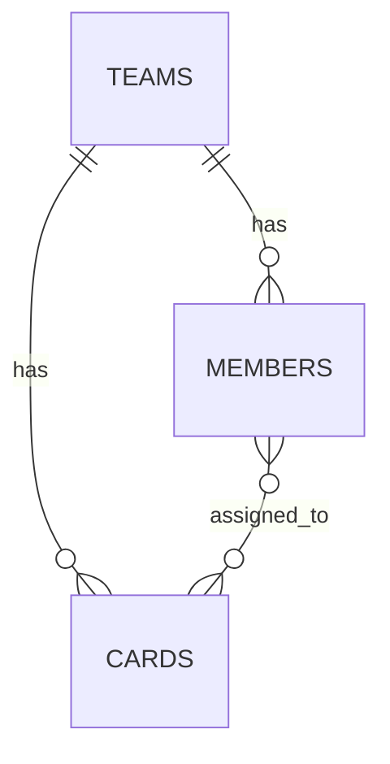

# 팀 프로젝트 역할 분담 앱 PRD

2026-09-17 · @Someone

## 개요

대학생 조별과제 팀은 카카오톡 대화방에서 역할과 마감일을 정하지만, 대화가 길어지면 누가 무엇을 맡았는지 금방 묻힌다. 그 결과 마감 하루 전에야 담당자가 불분명해지고 서로 미루는 문제가 반복된다.

이 앱은 팀원과 할 일을 카드로 등록하고, 칸반 보드에서 진행 상태를 드래그로 옮기며, 마감이 지난 카드를 빨간색으로 표시해 담당과 마감을 한눈에 보이게 만든다.

**타겟 사용자**: 3\~6명 규모의 대학생 조별과제 팀. 별도 앱 설치나 회원가입 없이 링크 하나로 바로 쓸 수 있어야 한다.

## 목표 및 성공 지표

**목표**

1. 팀원 간 담당 업무를 카카오톡 대화가 아닌 한 곳에서 확인할 수 있게 한다.
2. 마감일을 시각적으로 놓치지 않게 하여 막판 몰아치기를 줄인다.
3. 조장이나 특정 인원 없이도 누구나 쉽게 카드를 만들고 옮길 수 있게 한다.

**성공 지표 (KPI)**

| 지표 | 목표 |
| --- | --- |
| 프로젝트당 등록된 카드 수 | 팀원 1인당 평균 2개 이상 |
| 마감일 초과 카드 비율 | 도입 전 대비 30% 감소 |
| 프로젝트 종료 시점 '완료' 칼럼 도달률 | 80% 이상 |
| 다음 학기 재사용률 | 40% 이상 |

## 핵심 기능

### 1. 팀원 및 할 일 입력

- 프로젝트 생성 시 팀원 이름을 일괄 등록(쉼표 또는 줄바꿈 구분)하거나, 카드 생성 시 담당자를 자유 입력/선택할 수 있다.
- 카드 생성 시 필수 입력: 할 일 제목, 담당자(1명 또는 복수 선택), 마감일.
- 선택 입력: 설명, 우선순위, 참고 링크.

### 2. 카드

- 카드에는 제목, 담당자 아바타/이니셜, 마감일(D-day 표시), 상태 라벨을 표시한다.
- 카드 클릭 시 상세 편집 모달에서 내용 수정 및 삭제가 가능하다.
- 담당자가 여러 명인 카드는 아바타를 겹쳐서 표시한다.

### 3. 칸반 보드 (할 일 / 진행 중 / 완료)

- 3개의 고정 칼럼: 할 일(To Do), 진행 중(In Progress), 완료(Done).
- 카드를 마우스 드래그(모바일은 터치 드래그)로 칼럼 간 이동, 같은 칼럼 내 순서 변경도 지원한다.
- 이동 시 서버에 즉시 반영되어 다른 팀원 화면에도 실시간으로 보인다(팀원 여러 명이 동시에 접속하는 상황을 전제).
- 드래그 중 시각 피드백(카드 그림자, 드롭 위치 하이라이트)을 제공한다.

### 4. 마감일 지난 카드 강조

- 오늘 날짜 기준 마감일이 지났고 상태가 '완료'가 아닌 카드는 카드 배경/테두리를 빨간색으로 표시한다.
- 마감이 1\~2일 남은 카드는 노란색 등 경고색으로 표시해 사전에 인지하게 한다(선택 기능).
- '완료' 칼럼으로 옮긴 카드는 마감이 지났어도 빨간색 표시를 해제한다.

**엣지 케이스**

- 마감일 미입력 카드는 강조 표시 대상에서 제외하고 별도 '마감 미정' 라벨을 붙인다.
- 담당자가 팀원 목록에 없는 이름으로 입력된 경우 신규 팀원으로 자동 등록할지 확인한다.
- 동시에 여러 명이 같은 카드를 드래그할 경우 마지막 이동이 우선 반영되고, 다른 사용자에게는 실시간으로 갱신된 위치가 보인다.

## 사용자 시나리오

**시나리오 1 — 역할 정하기** 조장 지민이 새 보드를 만들고 팀원 4명 이름을 등록한다. 카톡방에서 나온 역할 분담을 그대로 카드로 옮겨 각자에게 배정한다. 이제 팀원들은 카톡을 뒤지지 않아도 보드 링크 하나로 자기 할 일을 확인할 수 있다.

**시나리오 2 — 진행 상황 공유** 팀원 하윤이 자료 조사를 시작하며 카드를 '할 일'에서 '진행 중'으로 옮긴다. 다른 팀원들은 실시간으로 보드에서 하윤의 진행 상황을 확인하고, 아직 손대지 않은 카드가 있는지 파악한다.

**시나리오 3 — 마감 임박** 발표 자료 작성을 맡은 준호가 마감일을 넘겼다. 카드가 자동으로 빨간색으로 바뀌면서 다른 팀원들이 보드만 보고도 지연을 즉시 알아채고, 카톡으로 재촉하지 않아도 자연스럽게 상황 공유가 된다.

## 기술 스택 및 아키텍처

### 프론트엔드

- **React + TypeScript**, 빌드 도구는 Vite.
- 드래그앤드롭은 **@dnd-kit/core** 사용을 권장한다. react-beautiful-dnd는 유지보수가 중단되어 신규 프로젝트에는 권장하지 않는다.
- 배포는 **Vercel**(무료 티어)로 프론트엔드를 배포한다.

### 백엔드 및 실시간 동기화 옵션 비교

| 옵션 | 설명 | 장점 | 단점 |
| --- | --- | --- | --- |
| Firebase (Firestore) | Google의 BaaS, 문서 기반 DB + 실시간 리스너 | 설정이 매우 빠름, 실시간 동기화 기본 제공, 무료 티어로 충분 | 복잡한 쿼리에 약함, 벤더 종속 |
| Supabase | Postgres 기반 BaaS, Realtime 채널 제공 | SQL 사용 가능(팀 데이터 모델에 적합), 오픈소스, 무료 티어 | Firebase보다 설정 단계가 한 단계 더 필요 |
| 직접 구축 (Node.js + Socket.io + MongoDB) | 커스텀 서버 | 완전한 커스터마이징 | 대학생 팀이 짧은 기간에 구축·배포·운영하기엔 부담 큼 |

**권장안**: 4주 내외의 짧은 개발 기간과 소규모 트래픽을 고려하면 **Supabase**(Postgres + Realtime + 간편 인증)를 권장한다. 학습 곡선이 낮고, 카드 이동 시 Realtime 채널로 모든 팀원 화면에 변경 사항을 즉시 전파할 수 있다.

### 아키텍처 개요

- 카드 상태 변경(드래그 완료) 시 클라이언트가 Supabase에 업데이트를 보내고, Supabase Realtime이 같은 보드를 보고 있는 다른 팀원 클라이언트에 변경 사항을 브로드캐스트한다.
- 마감 초과 여부는 클라이언트에서 '오늘 날짜 > 마감일 && 상태 ≠ 완료' 로 매 렌더링 시 계산하며, 별도 서버 배치 작업이 필요 없다.

## 데이터 모델

| 엔티티 | 필드 | 설명 |
| --- | --- | --- |
| **teams** | id, name, invite\_code, created\_at | 보드(프로젝트) 단위. invite\_code로 팀원 초대 |
| **members** | id, team\_id (FK), name, created\_at | 팀원 목록. 로그인 없이 이름 기반으로 등록 |
| **cards** | id, team\_id (FK), title, description, assignee\_ids, due\_date, status (todo / in\_progress / done), position, created\_at, updated\_at | 할 일 카드. status와 position으로 칼럼 내 위치 관리 |

**관계**: 하나의 team은 여러 member와 여러 card를 가진다. 하나의 card는 여러 member(담당자)를 가질 수 있다(다대다).

## 화면 설계 및 UX 가이드

### 주요 화면

1. **보드 화면**: '할 일 / 진행 중 / 완료' 3칼럼이 나란히 배치된 칸반 보드. 상단에 팀 이름과 팀원 아바타 목록.
2. **카드 생성/수정 모달**: 제목, 담당자 선택(팀원 목록에서 다중 선택), 마감일 선택(날짜 피커), 설명(선택).
3. **팀원 관리**: 팀원 추가/삭제, 초대 링크 복사.

### 마감일 시각 표시 규칙

| 상태 | 표시 |
| --- | --- |
| 마감일 D-2 이상 남음, 미완료 | 기본(회색/흰색) 카드 |
| 마감일 D-1 \~ D-day, 미완료 | 노란색 테두리/배지 |
| 마감일 초과, 미완료 | 빨간색 배경 또는 테두리 + '지연' 배지 |
| 상태가 '완료' | 마감 초과 여부와 무관하게 강조 해제, 완료 배지만 표시 |

### 모바일 대응

- 화면 폭이 좁을 때는 3칼럼을 가로 스와이프로 전환하거나, 칼럼을 탭으로 전환하는 방식을 사용한다.
- 드래그앤드롭은 터치 이벤트를 지원하는 라이브러리(@dnd-kit)를 사용해 모바일에서도 동일하게 동작해야 한다.
- 대학생이 수업 중 스마트폰으로 빠르게 확인하는 경우가 많으므로, 카드 정보는 제목·담당자·마감일 위주로 축약해서 보여준다.

## MVP 범위 및 개발 로드맵

### 1차 MVP (2\~3주)

- 팀 생성 및 초대 링크
- 팀원 등록(로그인 없이 이름 기반)
- 카드 생성/수정/삭제
- 3칼럼 드래그앤드롭 보드
- 마감 초과 카드 빨간색 표시
- 실시간 동기화(Supabase Realtime)

### 2차 확장

- 마감 D-1 카카오톡/웹 푸시 알림 연동
- 카드별 댓글, 체크리스트
- 담당자별 필터링, 검색

### 3차 확장

- 프로젝트 완료 후 통계(팀원별 기여도, 지연 이력)
- 여러 프로젝트/학기 히스토리 관리
- 마감일 기준 캘린더 뷰

**권장 진행 순서**: 1차 MVP를 먼저 완성해 실제 조별과제에 사용해보고, 팀원들의 피드백을 바탕으로 2차 확장(특히 알림)의 우선순위를 정한다.

## 비기능 요구사항

- **실시간성**: 카드 이동이 다른 팀원 화면에 2초 이내 반영되어야 한다.
- **인증**: 대학생 팀이 빠르게 쓸 수 있도록 별도 회원가입 없이 초대 링크 + 이름 입력만으로 참여 가능하게 한다. 초대 링크에는 추측 불가능한 코드를 사용해 팀 데이터를 보호한다.
- **접근성**: 마감 초과 표시는 색상(빨간색)뿐 아니라 '지연' 텍스트 배지를 함께 제공해 색맹 사용자도 구분할 수 있게 한다.
- **성능**: 팀당 팀원 10명, 카드 100개 이하의 소규모 트래픽을 기준으로 설계하며 별도 캐싱이나 서버 확장은 필요하지 않다.
- **데이터 보관**: 이름 외의 개인정보는 수집하지 않으며, 학기 종료 후 일정 기간(예: 6개월) 뒤 데이터 삭제 정책을 안내한다.
